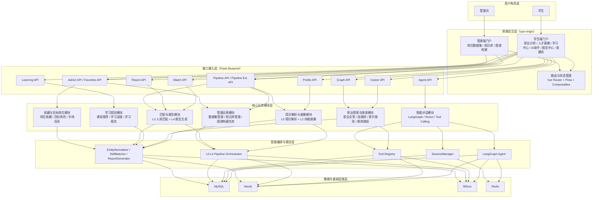
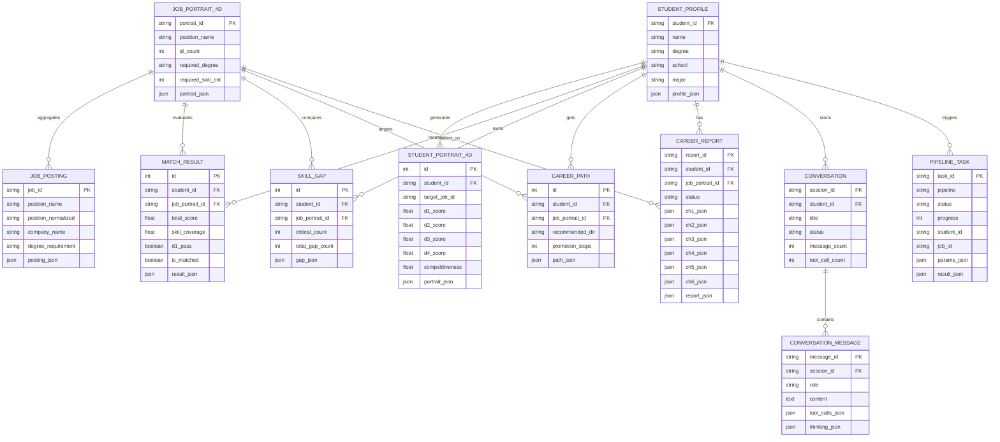
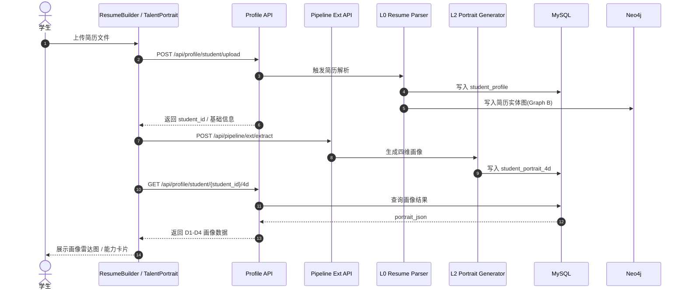
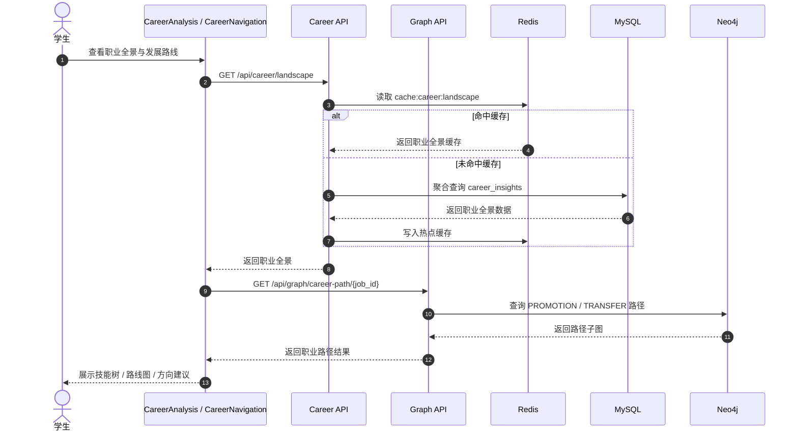
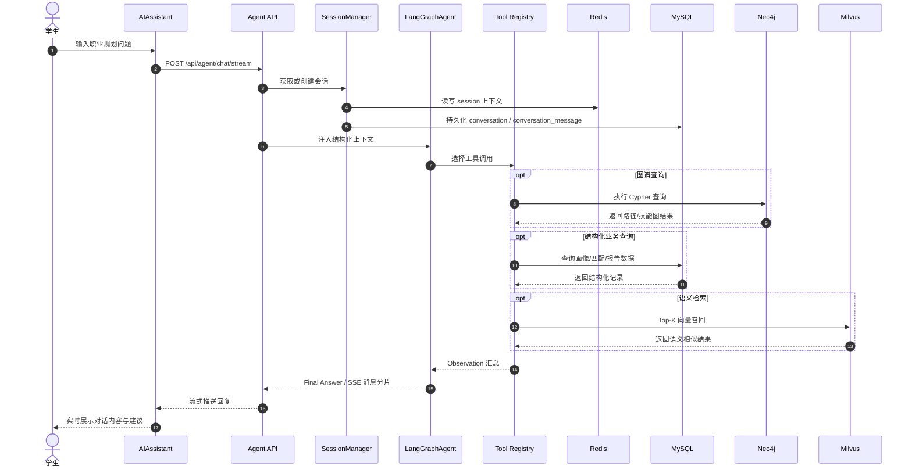
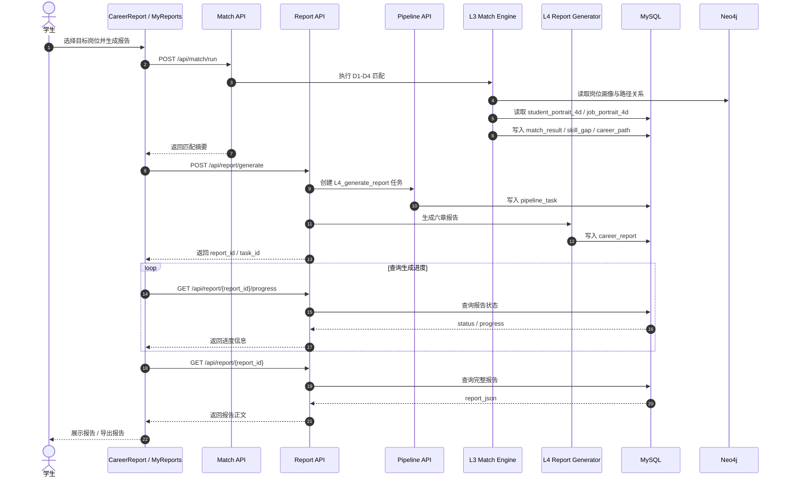
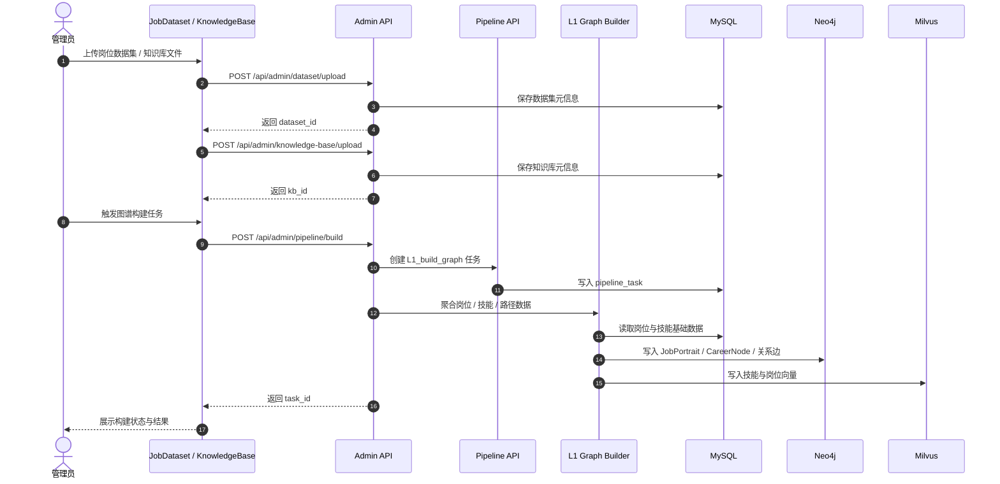

# CPA-Agent 系统设计文档

> 用途：项目文档 / 方案书 / 答辩材料
> 范围：系统架构图、系统总体设计、数据库设计、系统详细设计
> 说明：本文档按目标交付形态描述系统，不区分前端页面当前是否采用 mock 数据

---

## 一、系统架构图

```mermaid
flowchart TB
    subgraph 用户层["👤 用户层"]
        U1[冷启动小白]
        U2[有简历应届生]
        U3[AI对话驱动]
        U4[目标明确型]
        U5[报告生成型]
        U6[管理员]
    end

    subgraph 前端层["🖥️ Vue3 前端层 (cpa-xingtu)"]
        direction TB
        
        subgraph 视图层["Views / Pages"]
            V1[AIAssistant.vue<br/>AI助手对话]
            V2[ResumeBuilder.vue<br/>简历制作]
            V3[CareerAnalysis.vue<br/>职业分析]
            V4[TalentPortrait.vue<br/>个人能力画像]
            V5[CareerNavigation.vue<br/>职途导航]
            V6[CareerReport.vue<br/>发展报告]
            V7[LearningCenter.vue<br/>技能提升]
            V8[HomeCenter.vue<br/>首页]
        end
        
        subgraph 组件层["Components"]
            C1[文件上传组件]
            C2[简历解析结果展示]
            C3[四维雷达图]
            C4[技能网络图]
            C5[地铁图可视化]
            C6[课程推荐卡片]
        end
        
        subgraph 状态层["Pinia Stores"]
            S1[resumeStore<br/>简历数据]
            S2[learningStore<br/>学习记录]
            S3[userStore<br/>用户信息]
            S4[authStore<br/>认证状态]
        end
        
        subgraph API层["API Clients"]
            A1[agent.ts<br/>Agent对话]
            A2[http.ts<br/>HTTP基础]
            A3[report.ts<br/>报告管理]
        end
    end

    subgraph 网关层["🌐 API Gateway (Flask)"]
        G1["/api/agent/*"<br/>Agent路由]
        G2["/api/pipeline/*"<br/>管线路由]
        G3["/api/profile/*"<br/>画像路由]
        G4["/api/match/*"<br/>匹配路由]
        G5["/api/report/*"<br/>报告路由]
        G6["/api/career/*"<br/>职业路由]
        G7["/api/admin/*"<br/>管理路由]
    end

    subgraph 服务层["⚙️ 业务服务层 (Services)"]
        direction TB
        
        subgraph Agent服务["Agent 编排"]
            AG1[LangGraphAgent<br/>状态图编排]
            AG2[ReactAgent<br/>ReAct兜底]
            AG3[SessionManager<br/>会话管理]
            AG4[子Agent路由<br/>planner/profile/match/report/qa]
        end
        
        subgraph 管线服务["L0-L4 Pipeline"]
            P1[L0 Parser<br/>MinerU PDF解析]
            P2[L1 Extractor<br/>NS-LE实体抽取]
            P3[L2 Portrait<br/>四维画像生成]
            P4[L3 Match<br/>人岗匹配]
            P5[L4 Report<br/>职业报告]
        end
        
        subgraph 核心服务["核心能力"]
            SVC1[EntityNormalizer<br/>实体归一化]
            SVC2[SkillMatcher<br/>技能匹配]
            SVC3[GraphStorage<br/>图谱存储]
            SVC4[EmbeddingService<br/>向量编码]
        end
        
        subgraph 工具集["Tools"]
            T1[GraphQueryTool<br/>图谱查询]
            T2[DbQueryTool<br/>数据库查询]
            T3[SemanticSearchTool<br/>语义检索]
            T4[PipelineRunTool<br/>管线触发]
            T5[SkillTools<br/>技能工具集]
        end
    end

    subgraph 数据层["💾 四库分治架构"]
        direction TB
        
        subgraph Neo4j["🕸️ Neo4j 知识图谱"]
            N1[Skill 节点<br/>~500个]
            N2[SkillCategory 节点<br/>30个]
            N3[JobPortrait 节点<br/>≥10个]
            N4[CareerNode 节点<br/>~40个]
            N5[简历实体节点<br/>19种标签]
            N6[PROMOTION 边<br/>晋升路径]
            N7[TRANSFER 边<br/>换岗路径]
            N8[BELONGS_TO 边<br/>技能分类]
        end
        
        subgraph MySQL["🗃️ MySQL 8.0 主库"]
            M1[student_profile<br/>学生档案]
            M2[job_posting<br/>岗位信息]
            M3[student_portrait_4d<br/>四维画像]
            M4[job_portrait_4d<br/>岗位画像]
            M5[match_result<br/>匹配结果]
            M6[skill_gap<br/>技能差距]
            M7[career_report<br/>职业报告]
            M8[conversation<br/>会话记录]
            M9[conversation_message<br/>消息记录]
            M10[skill_taxonomy<br/>技能分类]
            M11[canonical_entity<br/>规范实体]
            M12[normalization_rule<br/>归一化规则]
        end
        
        subgraph Milvus["🔍 Milvus Lite 向量库"]
            VDB1[skill_vectors<br/>技能向量]
            VDB2[jd_vectors<br/>JD语义向量]
            VDB3[resume_vectors<br/>简历向量]
            VDB4[conversation_vectors<br/>对话记忆]
        end
        
        subgraph Redis["⚡ Redis 7.x 缓存"]
            R1[session-id<br/>会话上下文]
            R2[cache-portrait-job-id<br/>岗位画像缓存]
            R3[task-id<br/>任务状态]
        end
    end

    %% 数据流向
    U1 --> V8 --> V3
    U2 --> V2 --> C1 --> A1 --> G2 --> P1 --> P2 --> P3
    U3 --> V1 --> A1 --> G1 --> AG1 --> T1 & T2 & T3
    U4 --> V3 --> V4 --> V5
    U5 --> V6 --> A3 --> G5 --> P5
    U6 --> G7
    
    V1 -.->|"SSE 流式"| A1
    V2 -.->|"生成简历文本"| G2
    V4 -.->|"查看画像"| G3
    V5 -.->|"职业路径"| G6
    
    AG1 -->|"工具调用"| T1 & T2 & T3 & T4 & T5
    T1 -->|"Cypher 查询"| N1 & N2 & N3 & N4
    T2 -->|"SQL 查询"| M1 & M3 & M5
    T3 -->|"向量检索"| VDB1 & VDB2
    T4 -->|"触发"| P1 & P2 & P3 & P4 & P5
    
    P1 -->|"PDF解析"| SVC1
    P2 -->|"实体抽取"| SVC1 -->|"归一化"| M11 & M12
    P3 -->|"画像生成"| SVC2 -->|"语义匹配"| VDB1
    P4 -->|"匹配计算"| SVC2 -->|"联合打分"| N3 & M4
    P5 -->|"报告生成"| T1 & T2
    
    AG3 -->|"会话读写"| R1 & M8 & M9
    SVC4 -->|"编码"| VDB1 & VDB2 & VDB3 & VDB4
    
    %% 样式
    classDef frontend fill:#e3f2fd,stroke:#1976d2
    classDef backend fill:#e8f5e9,stroke:#388e3c
    classDef database fill:#fff3e0,stroke:#f57c00
    classDef agent fill:#f3e5f5,stroke:#7b1fa2
    classDef pipeline fill:#fce4ec,stroke:#c2185b
    
    class V1,V2,V3,V4,V5,V6,V7,V8,C1,C2,C3,C4,C5,C6,S1,S2,S3,S4,A1,A2,A3 frontend
    class G1,G2,G3,G4,G5,G6,G7,AG1,AG2,AG3,AG4,T1,T2,T3,T4,T5,SVC1,SVC2,SVC3,SVC4 backend
    class P1,P2,P3,P4,P5 pipeline
    class N1,N2,N3,N4,N5,N6,N7,N8,M1,M2,M3,M4,M5,M6,M7,M8,M9,M10,M11,M12,VDB1,VDB2,VDB3,VDB4,R1,R2,R3 database
    class AG1,AG2,AG3,AG4 agent
```

---

## 图示说明

### 分层架构
- **用户层**: 6 类差异化用户画像
- **前端层**: Vue3 + Pinia + Element Plus，视图/组件/状态/API 四层
- **网关层**: Flask Blueprint 路由分发
- **服务层**: Agent 编排 + Pipeline 管线 + 核心服务 + 工具集
- **数据层**: 四库分治（Neo4j + MySQL + Milvus + Redis）

### 核心数据流
1. **简历解析流**: L0 → L1 → L2 → MySQL + Neo4j + Milvus
2. **Agent 对话流**: LangGraph → Tools → 四库联合查询
3. **职业路径流**: Neo4j PROMOTION/TRANSFER 边 → 前端地铁图
4. **缓存加速流**: Redis → 热数据 → 降级 MySQL

### 阅读说明
- 本图用于展示系统的**目标交付架构**，适合在总体设计章节作为总图。
- 讲解时建议按“用户层 → 前端层 → API 网关 → 业务服务层 → 智能体/管线层 → 数据层”顺序展开。
- 其中 `LangGraph Agent + L0-L4 Pipeline + 四库分治` 是本系统区别于普通信息管理系统的核心亮点。

---

## 二、基于架构图的逐层展开讲解顺序

### 1. 用户与接入层
- 学生用户从职业分析、简历上传、学习中心、AI 助手、报告中心进入系统。
- 管理员从数据集管理、知识库管理、图谱构建入口进入系统。

### 2. 前端展示与交互层
- 前端采用 `Vue 3 + TypeScript + Vue Router + Pinia`。
- 页面承担职业分析、画像展示、报告查看、学习推荐、收藏管理、AI 对话等展示职责。

### 3. API 接入层
- 后端采用 `Flask Blueprint` 提供统一接口入口。
- 对外暴露 `agent / profile / match / report / graph / pipeline / learning / admin / favorites / career` 等业务域 API。

### 4. 智能服务与业务执行层
- `LangGraph / ReAct` 负责自然语言任务编排。
- `L0-L4 Pipeline` 负责简历解析、图谱构建、画像生成、匹配分析、报告生成。
- `EntityNormalizer / SkillMatcher / GraphStorage / EmbeddingService` 负责核心算法与能力支撑。

### 5. 数据基础设施层
- `MySQL` 负责结构化业务数据。
- `Neo4j` 负责知识图谱与职业路径图谱。
- `Milvus` 负责语义检索与向量召回。
- `Redis` 负责会话上下文与热数据缓存。

### 6. 形成闭环
- 简历进入系统后，经过 `L0 → L2 → L3 → L4` 形成画像、匹配与报告闭环。
- 用户对话进入系统后，由 Agent 联合调用图谱、数据库、向量检索和管线，形成智能问答闭环。

---

## 三、系统总体设计（功能模块层次图）

### 模块划分说明
- **简历解析与画像模块**：负责从简历输入到学生画像落库，是学生进入系统的起点。
- **职业探索与图谱模块**：负责职业全景、技能树、路径探索、岗位需求图谱等可视化分析能力。
- **学习规划模块**：负责课程推荐、学习进度跟踪、学习报告输出。
- **匹配与报告模块**：负责面向目标岗位执行匹配计算、技能差距分析和六章报告生成。
- **智能对话模块**：负责把自然语言需求转化为图谱查询、数据库查询、语义检索和管线调用。
- **管理运营模块**：负责岗位数据、知识库、图谱构建任务的运维入口。
- **收藏与目标岗位模块**：负责学生对岗位与职业方向的长期跟踪管理。

---

## 四、数据库设计（E-R 图）

### 4.1 关系型核心数据库 E-R 图

### 4.2 非关系型数据库职责映射

- **Neo4j（知识图谱）**
  - Graph A：`Skill / SkillCategory / JobPortrait / CareerNode`
  - Graph B：简历实体关系网络（19类实体、24类关系）

- **Milvus（向量库）**
  - `skill_vectors`
  - `jd_vectors`
  - `resume_vectors`
  - `conversation_vectors`

- **Redis（缓存与会话）**
  - `session:{id}`
  - `session:{id}:history`
  - `cache:career:*`
  - `task:{id}`

### 4.3 数据库设计说明
- **MySQL** 负责事务性业务数据，适合画像、匹配、报告、会话、任务管理。
- **Neo4j** 负责路径关系和技能依赖，更适合“晋升/换岗/邻居/先修”类查询。
- **Milvus** 负责语义相似召回，为课程推荐、技能语义匹配、RAG 问答提供支撑。
- **Redis** 负责热点数据与短期上下文，加速高频接口与 Agent 对话链路。

---

## 五、系统详细设计（UML 顺序图）

> 说明：以下顺序图统一采用“**左侧主动对象 → 中间业务模块 → 右侧被动存储/基础设施**”的布局方式，适合直接放入详细设计章节。

### 5.1 场景一：简历上传与人才画像生成

### 5.2 场景二：职业分析与路径探索

### 5.3 场景三：AI 助手对话与多工具协同

### 5.4 场景四：人岗匹配与职业报告生成

### 5.5 场景五：管理员触发知识库与图谱构建

---

## 六、文档使用建议

### 6.1 论文/方案书写法
- **系统架构图**：放在“系统总体架构”章节，强调分层与技术栈。
- **系统总体设计层次图**：放在“总体设计”章节，强调功能模块划分与模块关系。
- **数据库 E-R 图**：放在“数据库设计”章节，强调核心业务实体和关系。
- **顺序图**：放在“详细设计”章节，每个核心业务场景配 1 张顺序图。

### 6.2 答辩讲解顺序
- 先讲“系统由哪些层组成”。
- 再讲“每层有哪些核心模块”。
- 然后讲“数据如何在模块之间流动”。
- 最后用顺序图说明“核心场景是如何一步一步执行的”。

### 6.3 可直接作为章节标题
- **4.1 系统架构设计**
- **4.2 系统总体设计**
- **4.3 数据库设计**
- **4.4 系统详细设计**
